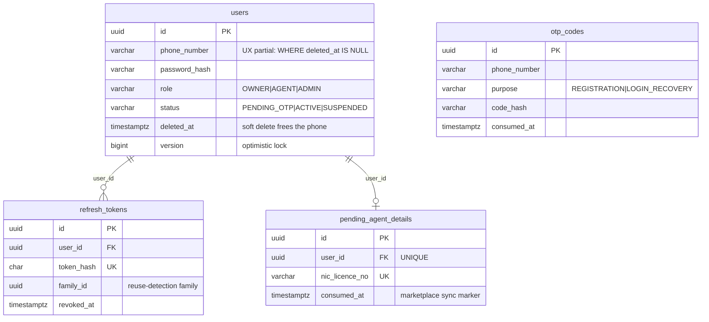
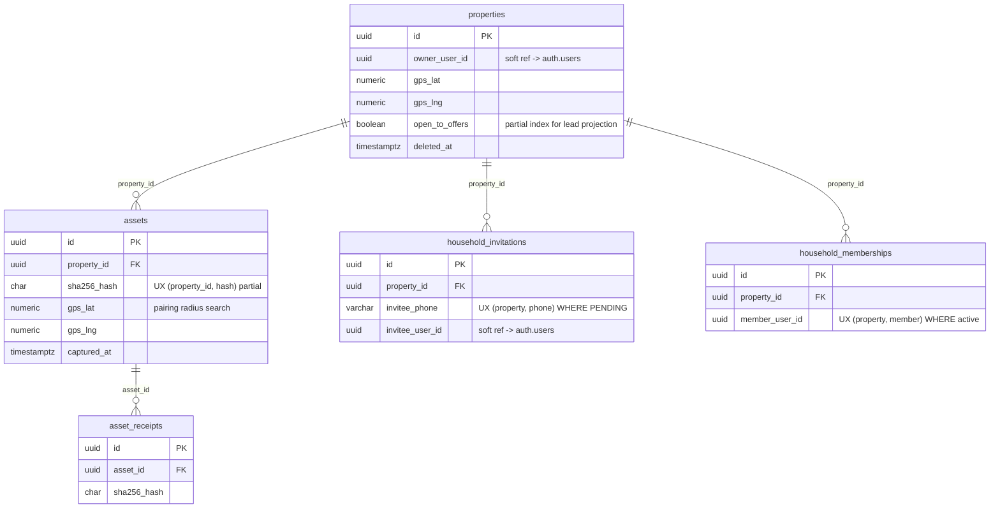
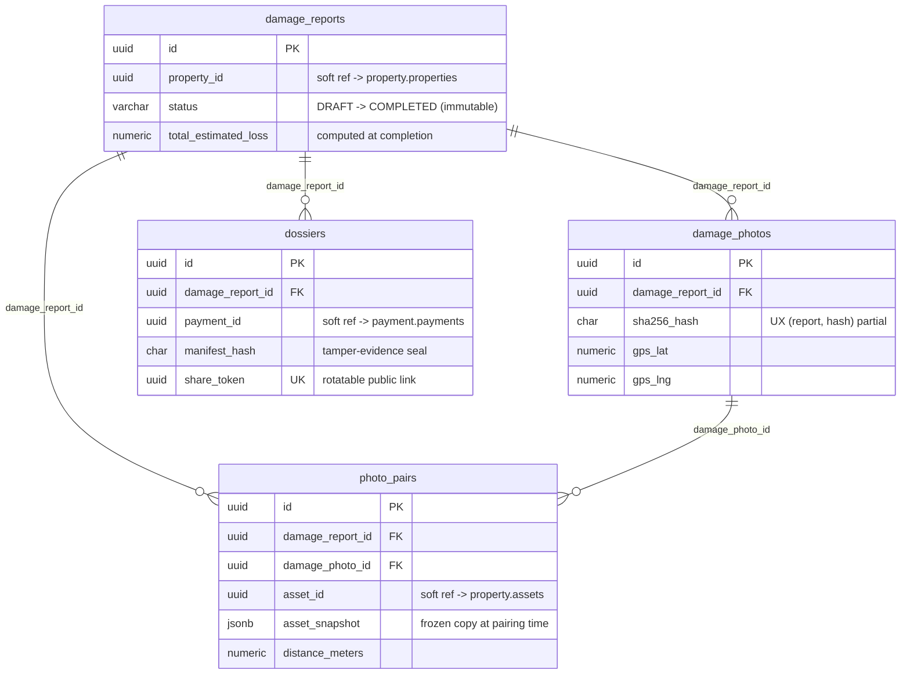
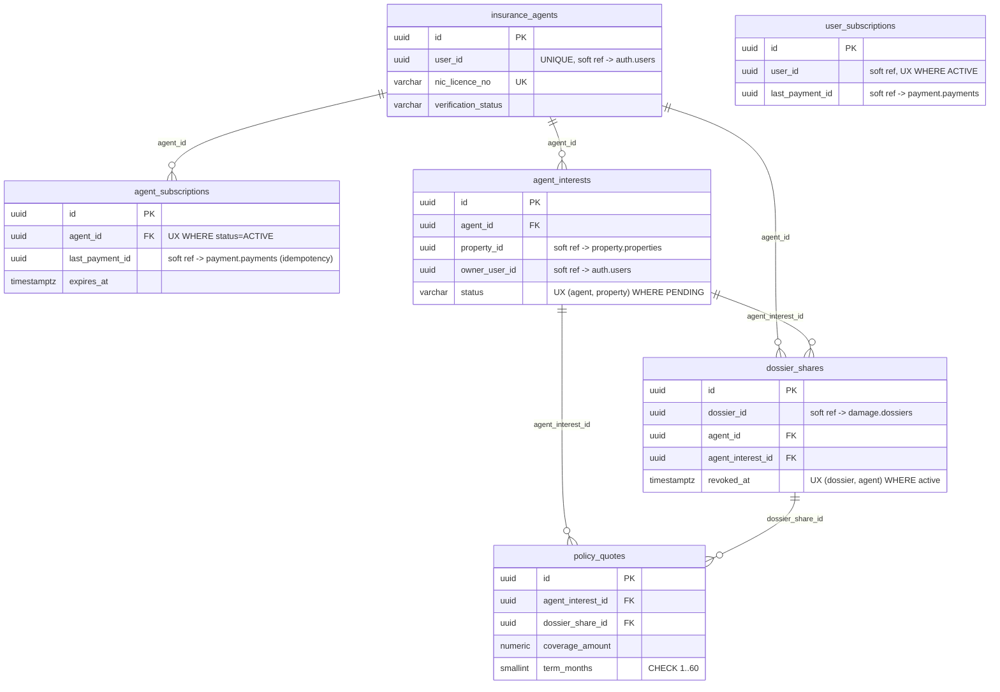
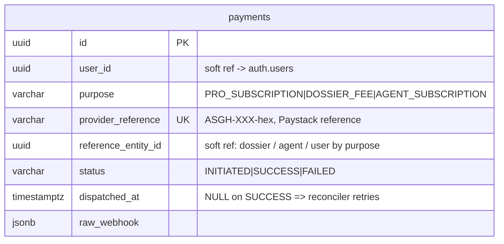
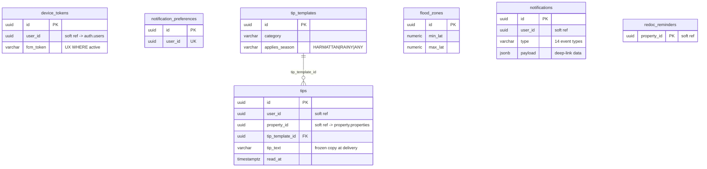
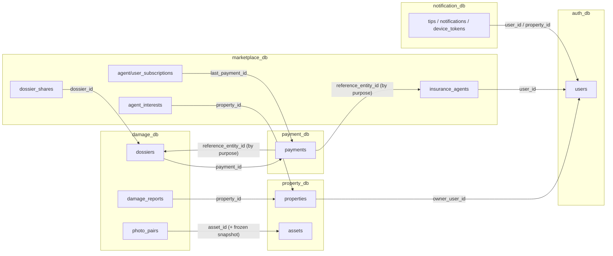

# AssetShield GH — Database Architecture

Six PostgreSQL databases, one per service, on a single dev cluster (database-per-service
pattern). **Hard foreign keys exist only *inside* a database**; anything that crosses a
service boundary is a *soft reference* — a plain UUID owned by the other service, validated
at the API layer, never by the schema. This is deliberate: cross-database FKs are impossible
in Postgres and cross-service FKs would couple deployments and block independent migrations.

Migrations are Flyway-owned (`ddl-auto: validate` everywhere — Hibernate never touches DDL).

---

## auth_db (auth-service)

OTP codes are keyed by phone (not user) on purpose: they exist before the user is ACTIVE.

## property_db (property-service)

`(property_id, sha256_hash)` partial-unique is the duplicate-photo guard the offline queue
relies on (replaying an upload 409s instead of duplicating).

## damage_db (damage-service)

`asset_snapshot` (JSONB) is **intentional denormalization**: evidence must reflect the asset
*as it was when paired*, even if the live asset is later edited or deleted. Normalizing it
away would corrupt the evidence chain.

## marketplace_db (marketplace-service)

FREE tier is the *absence* of an ACTIVE `user_subscriptions` row — no FREE rows stored.

## payment_db (payment-service)

`reference_entity_id` is a **purpose-discriminated soft reference**: for `DOSSIER_FEE` it is
a damage.dossiers id, for `AGENT_SUBSCRIPTION` a marketplace.insurance_agents id, for
`PRO_SUBSCRIPTION` the auth user id. Settlement dispatch routes on `purpose`.

## notification_db (notification-service)

---

## Cross-service reference map

Every arrow is a soft UUID reference validated by internal APIs (X-Internal-Api-Key),
never a database constraint. Consistency across boundaries is eventual and idempotent:
settlement replays are no-ops (`last_payment_id`), agent sync retries until consumed
(`pending_agent_details.consumed_at`), payment dispatch retries until acknowledged
(`payments.dispatched_at`).

---

## Design review findings (2026-07)

### Sound by design (do not "fix")
- **No cross-service FKs** — correct for database-per-service; the one violation ever made
  (marketplace `last_payment_id → payments` FK surviving the payment-service extraction)
  broke settlement and was dropped in `marketplace V3`.
- **Deliberate denormalization for evidence immutability**: `photo_pairs.asset_snapshot`,
  `tips.tip_text`, `dossiers.total_estimated_loss` are frozen copies. Normalizing them
  would let later edits rewrite history.
- **Partial unique indexes as state machines**: one ACTIVE subscription per agent/user, one
  PENDING interest per (agent, property), one active share per (dossier, agent), phone
  uniqueness only among non-deleted users (frees numbers on account deletion).
- **Optimistic locking** (`version`) on every mutable aggregate root.
- Otherwise the schema is 3NF: no repeating groups, no partial or transitive dependencies
  on non-key attributes.

### Gaps found → fixed by new migrations
| Migration | Fix | Why |
|---|---|---|
| `payment V2__payment_indexes` | `ix_payments_user (user_id, created_at DESC)` | billing history endpoint full-scanned |
| `payment V2__payment_indexes` | partial `ix_payments_undispatched` | reconciler scan; index holds only unhealthy rows |
| `marketplace V4__marketplace_indexes` | `ix_quotes_interest`, `ix_quotes_share` | Postgres does **not** auto-index FK columns; quote lists scanned |
| `marketplace V4__marketplace_indexes` | `ix_shares_agent` (partial, active) | agent's shared-dossier list had no agent-leading index |
| `marketplace V4__marketplace_indexes` | `ix_interests_property` | owner opt-out / lead detail path |
| `auth V3__otp_lookup_index` | `(phone, purpose, created_at DESC)` partial, replaces old | actual lookup includes purpose + recency sort |

### Future (not blocking)
- `assets` GPS proximity search uses a btree on (lat, lng) — fine at current scale; at
  10k+ assets per area, move to PostGIS `GIST` on a geography column.
- Cross-service purge saga: deleting an auth user leaves property/damage/marketplace rows
  keyed to a dead user id (documented limitation of the immediate-deactivation design).
- Table partitioning for `notifications`/`tips` by month once they exceed ~1M rows.
